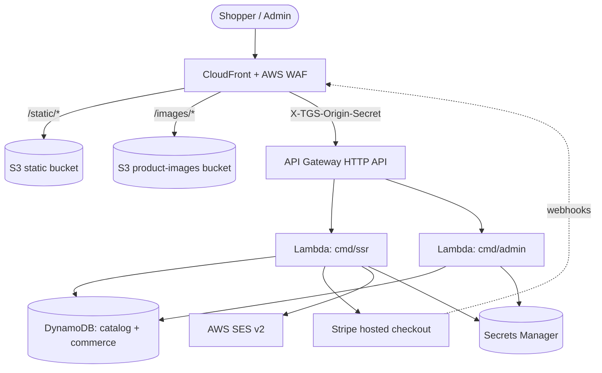

# Thailand Gift Shop

> Server-rendered Bangkok-style online gift shop — snacks, souvenirs, textiles, pantry, decor, wellness, and small keepsakes.

[](https://github.com/anhydrous99/thailandgiftshop/actions/workflows/ci.yml)
[](go.mod)
[](.nvmrc)
[](infra/)
[](web/)
[](https://stripe.com)
[](docs/deployment.md)

Monorepo for [`thailandgiftshop.com`](https://thailandgiftshop.com). Go Lambda backends render [`templ`](https://templ.guide) pages styled with Tailwind CSS v4; an AWS CDK v2 app (also Go) defines the infrastructure. Production deploys only to `us-east-1` — the CloudFront certificate lives in the same stack, so deploys intentionally fail elsewhere. The deployed stack ID is `ThailandGiftshopStack`.

> **Positioning rule:** keep it framed as an online gift *shop*. Do not reintroduce gift-set, bundle, or ready-to-wrap framing. See [`PAGE_IMPLEMENTATION_GUIDE.md`](PAGE_IMPLEMENTATION_GUIDE.md) for page/route conventions before adding pages.

## Contents

- [Features](#features)
- [Tech stack](#tech-stack)
- [Architecture](#architecture)
- [Project structure](#project-structure)
- [Prerequisites](#prerequisites)
- [Quick start](#quick-start)
- [Common commands](#common-commands)
- [Documentation](#documentation)
- [Contributing](#contributing)
- [Security](#security)
- [License](#license)

## Features

- **Catalog** — products with per-variant stock and categories, over a single-table DynamoDB design with four GSIs.
- **Customer accounts** — sign up/in, server-backed carts, saved addresses, and saved cards (brand/last4 only).
- **Guest checkout** — full end-to-end purchase with a signed, expiring tokenized order-access link instead of order history.
- **Stripe hosted checkout** — card entry happens only on Stripe (SAQ-A); the site never sees or stores card numbers. Refunds are issued automatically from the admin order desk.
- **Admin** — order desk (tracking, lifecycle, cancel, refund), product/category CRUD with optimistic concurrency, image upload to S3, and a business analytics dashboard.
- **Transactional email** — order, lifecycle, tracking, and password-reset mail via AWS SES (fake capture locally).
- **Observability** — CloudWatch EMF metrics, an operations dashboard, X-Ray tracing, and SNS alarms.

## Tech stack

| Layer | Technology |
| --- | --- |
| Language | Go 1.25 |
| Rendering | [`templ`](https://templ.guide) components compiled to `*_templ.go` |
| Styling | Tailwind CSS v4 + progressive-enhancement JS |
| Images | `sharp` responsive variants (`-320w`..`-1200w`, JPEG/WebP) |
| Compute | AWS Lambda (`ssr`, `admin`) behind API Gateway HTTP API |
| Edge | CloudFront + AWS WAF |
| Data | DynamoDB (single-table catalog + commerce) |
| Storage | S3 (`/static/` pruned, `/images/` retained) |
| Payments | Stripe hosted checkout |
| Email | AWS SES v2 |
| Infrastructure | AWS CDK v2 (Go) |
| Testing | Go unit tests + Playwright |
| CI/CD | GitHub Actions + OIDC |

## Architecture



CloudFront is the single public entry point: it serves assets from two private S3 buckets and forwards everything else to a private API Gateway, injecting an origin-secret header (`X-TGS-Origin-Secret`) the Lambdas verify. Three Go binaries share the `internal/` packages — `cmd/ssr` (storefront), `cmd/admin` (`/admin*`), and `cmd/seedcatalog` — while `cmd/devserver` runs the same handler code locally. See [`docs/architecture.md`](docs/architecture.md) for the full breakdown.

## Project structure

```
.
├── cmd/            Go entrypoints: ssr, admin, devserver, seedcatalog
├── internal/       Shared business logic (catalog, commerce, checkout, payments, ssr, admin, ...)
├── infra/          AWS CDK v2 app (Go) — the ThailandGiftshopStack
├── web/            Tailwind source, static assets, product images, Playwright tests
├── scripts/        Admin-secret generator and Go package helpers
└── docs/           Architecture, development, configuration, deployment, operations
```

## Prerequisites

- Go 1.25 or newer
- Node.js 24 LTS (frontend asset builds, browser tests, CDK commands)
- AWS credentials only if you intend to read deployed data or deploy

## Quick start

Run the full storefront and admin locally with **no AWS and no Stripe** using demo mode (in-memory catalog + fake payments + on-site checkout):

```sh
git clone https://github.com/anhydrous99/thailandgiftshop.git
cd thailandgiftshop
go mod download && npm --prefix web ci

# Generate local-only admin credentials (prints a one-time ADMIN_PASSWORD=... to sign in to /admin)
go run ./scripts/generate-admin-secret.go -out /tmp/tgs-admin-secret.json
export ADMIN_CREDENTIALS_SECRET_JSON="$(cat /tmp/tgs-admin-secret.json)"

# Start the devserver in demo mode
CATALOG_DEMO_STORE=1 CART_COOKIE_SECRET=dev CUSTOMER_SESSION_SECRET=dev \
  go run ./cmd/devserver
```

Open `http://127.0.0.1:8080` for the storefront and `http://127.0.0.1:8080/admin` for the admin. Placing an order redirects to the on-site `/checkout/fake-pay` demo page and the order appears in the admin order desk — the whole journey runs offline.

To connect to a deployed catalog, build assets, or run against Stripe instead, see [`docs/development.md`](docs/development.md) and [`docs/configuration.md`](docs/configuration.md).

## Common commands

| Task | Command |
| --- | --- |
| Run the devserver | `go run ./cmd/devserver` |
| Regenerate templ code | `go tool templ generate` |
| Build frontend assets | `npm --prefix web run build` |
| Run Go tests | `go test $(sh scripts/go-packages.sh)` |
| Run browser tests | `npm --prefix web test` |
| Check formatting | `gofmt -l $(git ls-files '*.go')` |
| Synthesize the CDK stack | `AWS_REGION=us-east-1 CDK_DEFAULT_REGION=us-east-1 npm --prefix infra run synth` |

Two codegen steps must run (and their output committed) before tests/CI pass on a change: `go tool templ generate` after `.templ` edits and `npm --prefix web run build` after Tailwind/template edits.

## Documentation

| Document | What's inside |
| --- | --- |
| [docs/architecture.md](docs/architecture.md) | System design, binaries, data model, internal packages, infra. |
| [docs/development.md](docs/development.md) | Local setup, devserver, demo mode, seeding, codegen, tests. |
| [docs/configuration.md](docs/configuration.md) | Environment-variable reference and secret/signing semantics. |
| [docs/deployment.md](docs/deployment.md) | CDK bootstrap, secrets, Stripe/SES setup, deploy, CI/CD. |
| [docs/operations.md](docs/operations.md) | Observability, edge-log invariants, refunds, WAF, webhooks. |
| [AGENTS.md](AGENTS.md) / [CLAUDE.md](CLAUDE.md) | Conventions and gotchas for AI coding agents. |
| [PAGE_IMPLEMENTATION_GUIDE.md](PAGE_IMPLEMENTATION_GUIDE.md) | Page, route, and category conventions. |

## Contributing

- Commits follow Conventional Commit style with scopes, e.g. `feat(commerce): guest checkout with tokenized order access`.
- Run `gofmt` and `go vet $(sh scripts/go-packages.sh)` before changes that touch Go behavior or infrastructure; CI fails on unformatted files.
- Commit generated artifacts alongside their source: `*_templ.go` after templ edits, and built CSS/images after asset edits.
- Summarize behavior changes in pull requests, list the validation commands you ran, and include screenshots or Playwright traces for visible UI changes.

See [AGENTS.md](AGENTS.md) for the full repository guidelines.

## Security

- No real secrets live in the repository. Production loads admin, Stripe, and signing secrets from AWS Secrets Manager at runtime; local/dev uses generated or inline overrides. Never commit plaintext passwords, bcrypt hashes, or session/cookie secrets.
- Card entry happens exclusively on Stripe's hosted checkout page; the site never sees or stores card numbers.
- **Logging invariant:** access logs must never include raw paths or query strings, because guest order access tokens can appear in URLs. See [docs/operations.md](docs/operations.md#edge-log-invariants).

## License

Proprietary — all rights reserved. This repository is not currently published under an open-source license.
