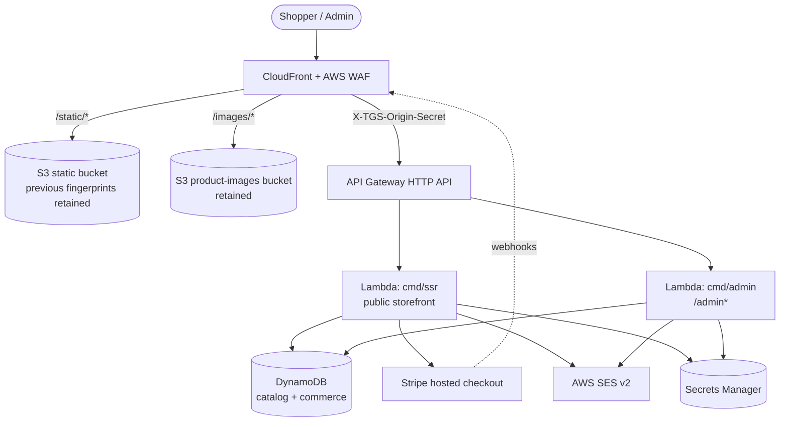

# Architecture

Human-facing architecture overview for `thailandgiftshop.com`. For agent-facing conventions and gotchas, see [`CLAUDE.md`](../CLAUDE.md) and [`AGENTS.md`](../AGENTS.md). For page/route conventions, see [`PAGE_IMPLEMENTATION_GUIDE.md`](../PAGE_IMPLEMENTATION_GUIDE.md).

## Overview

A server-rendered Bangkok-style online gift shop. Go Lambda backends render [`templ`](https://templ.guide) pages styled with Tailwind CSS v4; an AWS CDK v2 app (also written in Go) defines the infrastructure. Production deploys only to `us-east-1` because the CloudFront certificate lives in the same stack, and deploys intentionally fail elsewhere. The deployed stack ID is `ThailandGiftshopStack`.

## Request flow

CloudFront is the single public entry point. It serves static assets and product images directly from two private S3 buckets and forwards everything else to a private API Gateway HTTP API, injecting an origin-secret header (`X-TGS-Origin-Secret`) that the Lambdas verify. Direct API Gateway access is rejected in production. Stripe webhooks arrive through the same CloudFront/apex path at `/webhooks/stripe`.

## Binaries (`cmd/`)

Three Go binaries share the `internal/` packages. A local-only devserver runs the same handler code outside Lambda.

| Binary | Role |
| --- | --- |
| `cmd/ssr` | Public storefront Lambda behind API Gateway HTTP API + CloudFront. |
| `cmd/admin` | Admin Lambda serving `/admin*`. CloudFront injects an origin-secret header the Lambda verifies; direct API Gateway access is rejected in production. |
| `cmd/seedcatalog` | Seeds/backfills the DynamoDB catalog (insert-only). |
| `cmd/devserver` | Local-only HTTP server. Adapts `net/http` requests into `events.APIGatewayV2HTTPRequest` and dispatches to the **same** ssr/admin handlers, so Lambda code is exercised locally. |

**Handler shape:** handlers take and return API Gateway v2 events rather than `http.Handler`. `NewHandlerFromEnvironment(ctx)` wires production dependencies from environment variables; `NewHandler*` variants exist for tests and the local demo path. Routing is done by hand inside `handler.go` (a `pageKind`/`pageRoute` switch in ssr), not a router library.

## Rendering

`templ` components (`.templ` files compiled to generated `*_templ.go`) plus Tailwind v4 and small progressive-enhancement JavaScript where needed. The site is functional without JavaScript. Each page gets a view model in `internal/ssr/view_models.go`. Generated `*_templ.go` files are committed and must never be hand-edited; regenerate them with `go tool templ generate` after editing any `.templ` file.

## Data layer

### Catalog

`internal/catalog` is the data core, backed by a **single DynamoDB table** (`thailandgiftshop-catalog`, keys `pk`/`sk`) with four global secondary indexes:

| Index | Env var | Default name | Purpose |
| --- | --- | --- | --- |
| Slug | `CATALOG_SLUG_INDEX_NAME` | `slug-index` | Product lookup by slug. |
| Public | `CATALOG_PUBLIC_INDEX_NAME` | `public-index` | Active/public product reads. |
| Recent | `CATALOG_RECENT_INDEX_NAME` | `recent-index` | Latest active products (home page). |
| Entity | `CATALOG_ENTITY_INDEX_NAME` | `entity-index` | Admin product/category lists. |

Two interfaces split the read paths:

- `Store` — public read access (active products, by slug, by category, recent).
- `AdminStore` — admin CRUD with optimistic concurrency (`Version` field, conditional writes).

Implementations: `dynamo.go` (production), `memory.go` + `demo_seed.go` (the `CATALOG_DEMO_STORE=1` path), and `EmptyStore` (default when `CATALOG_TABLE_NAME` is unset). Products support variants with per-variant stock.

### Commerce

Customers, sessions, addresses, carts, and orders live in `internal/commerce`, backed by the `thailandgiftshop-commerce` DynamoDB table (`COMMERCE_TABLE_NAME`) with two indexes that default to `customer-orders-index` and `orders-index`. When `COMMERCE_TABLE_NAME` is unset outside production, the devserver uses an in-memory commerce store. Sessions are server-side rows with HMAC-signed cookies; signed-in carts are stored server-side, and the `__Host-tgs_cart` cookie becomes a write-through mirror so the header cart label stays cookie-only and catalog pages stay edge-cacheable.

## Internal packages (`internal/`)

| Package | Responsibility |
| --- | --- |
| `ssr` | Public site handlers, routing, templ pages, view models, SEO. |
| `admin` | Admin handlers: bcrypt credentials, sessions, CSRF, login throttling, product/category CRUD, order desk, analytics, image upload to S3. |
| `catalog` | Product/category data core over the single-table DynamoDB design. |
| `commerce` | Customers, sessions, addresses, carts, orders, password reset, throttling. |
| `checkout` | Checkout orchestration, stock reservation, guest access tokens. |
| `payments` | Payment providers: Stripe hosted checkout and the in-memory fake. |
| `cart` | Cookie-based cart, HMAC-signed via `CART_COOKIE_SECRET`. |
| `email` | Transactional email builders and SES/fake senders. |
| `location` | Address validation support. |
| `signedtoken` | HMAC-signed token primitives (guest access, cursors, CSRF). |
| `httpapi` | Shared API Gateway request/response helpers and origin checks. |
| `observability` | CloudWatch embedded metric format (EMF) recorder. |
| `appenv` | `APP_ENV=production` detection. |
| `awsconfig` | Shared AWS SDK config across service clients. |
| `staticassets` | Generated static asset manifest/fingerprints. |

## Infrastructure (`infra/`)

`infra/main.go` defines one CDK stack, `ThailandGiftshopStack`:

- CloudFront distribution + AWS WAF web ACL.
- API Gateway HTTP API with two routes (ssr and admin).
- DynamoDB catalog table and an admin-login-attempts table.
- Two S3 buckets: `/static/` and `/images/`, both deployed with pruning disabled so previous fingerprinted assets and uploaded product images survive deploys.
- Secrets Manager references (cart secret, customer session secret, admin credentials, Stripe credentials).
- Route53-backed SES identity with Easy DKIM.
- SNS alarm topic and a CloudWatch operations dashboard.

The CDK stack imports Go `internal/*` constants so env var names and table/index names stay in sync between infrastructure and application code.

## Storage and assets

- Static assets live in `web/static/` and are served under `/static/` (so `web/static/logo.svg` is available at `/static/logo.svg`). Deployment does not prune this bucket; previous fingerprinted assets remain available to cached pages.
- Product image seed assets live in `web/product-images/` and are served under `/images/` (so `web/product-images/products/mango-sticky-rice-kit.jpg` is available at `/images/products/mango-sticky-rice-kit.jpg`). This bucket is **retained and not pruned** so future uploaded product images are not removed by site deploys. `npm --prefix web run build` refreshes the generated `-320w` through `-1200w` JPEG/WebP variants used by storefront `srcset` markup.

## Payments and email selection

- **Payments** are selected by environment. With Stripe credentials present, Stripe-hosted checkout is used; otherwise non-production runs fall back to the in-memory fake provider, and production fails closed. Card entry happens exclusively on Stripe's hosted checkout page (SAQ-A); the site never sees or stores card numbers and persists only Stripe opaque IDs plus brand/last4 for display.
- **Email** is selected by environment. Local, demo, and test runs use fake capture and never call AWS SES. Production uses AWS SES v2 transactional mail through the verified `thailandgiftshop.com` identity and fails closed when sender config is missing, invalid, or set to fake mode.

See [`configuration.md`](configuration.md) for the environment-variable reference and [`operations.md`](operations.md) for the observability and refund runbook.
